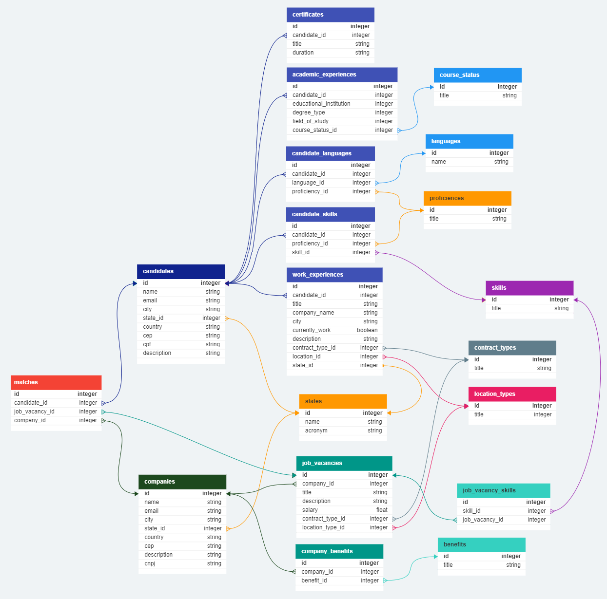

# Linketinder

Projeto para desenvolver uma aplicação chamada Linketinder.

## Features
* Criado aplicação em Groovy.
* CRUD de Candidatos e Empresas
* Criado persistência em .json para manter os Candidatos e Empresas salvas e facilitar o uso.
* Criado frontend em Typescript, HTML e CSS.
* Feito a modelagem do Banco de Dados.
* Criado Banco de Dados PostgreSQL

## MER

### Como executar
O arquivo que tem o método main para a execução do projeto está em:

* Pasta: src/main/groovy/com/linketinder
* Arquivo: Main.groovy

==================================================
### Feito por: Willian Henrique de Oliveira
==================================================
